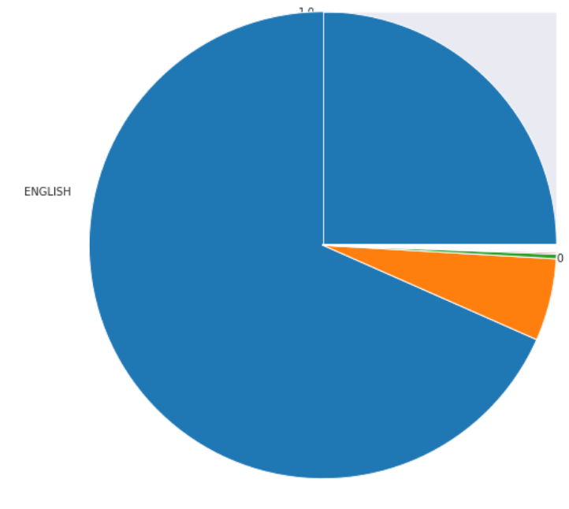
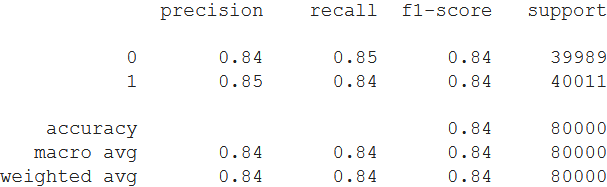

# Sentiment-analysis-on-1.6M-tweets
## Dataset
Dataset consists of 1.6 Millions of Tweets

## Importing Dataset
### Data set is imported from Kaggle

## Pre-Processed Text

## Detected Language

## Pie Chart

## Model Summary

## Confusion Matrix

